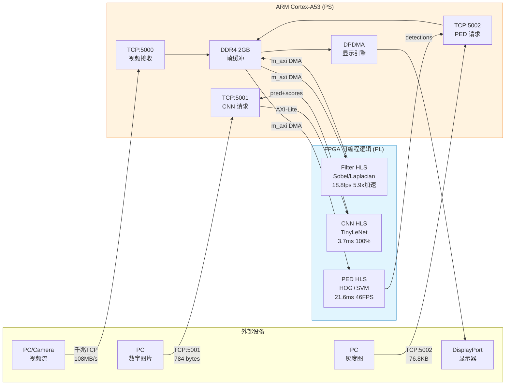
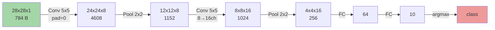
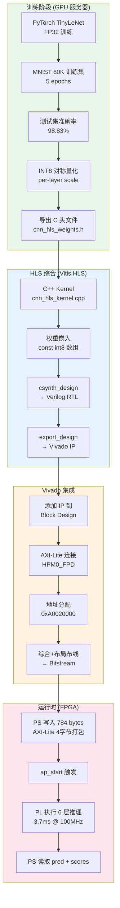
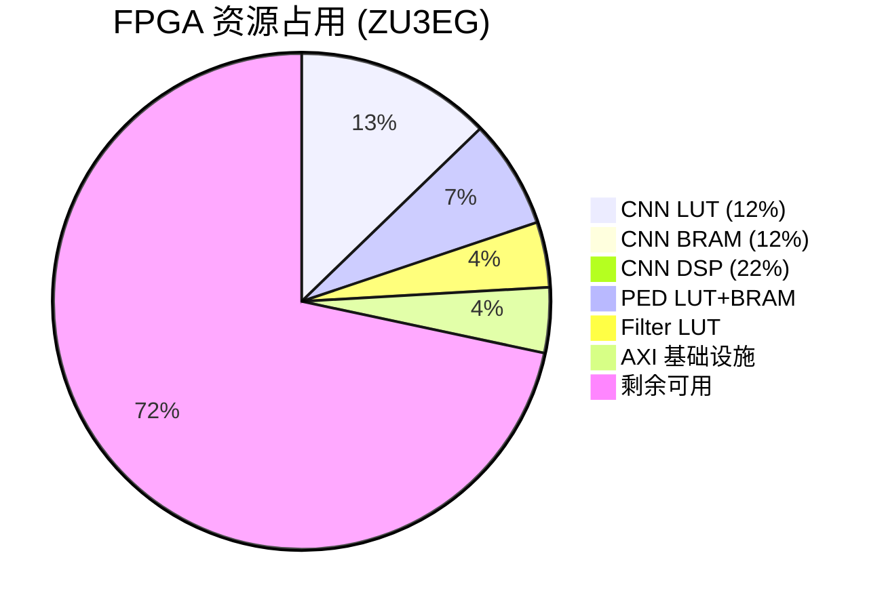
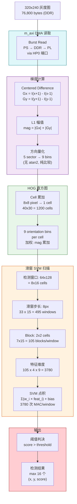
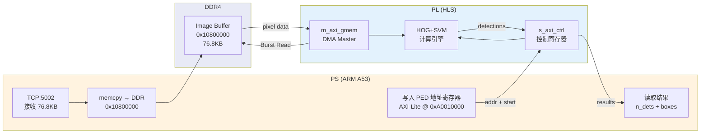
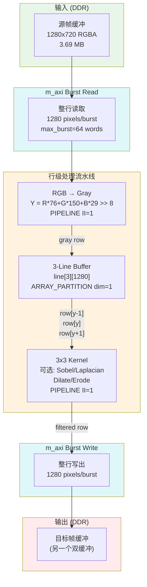
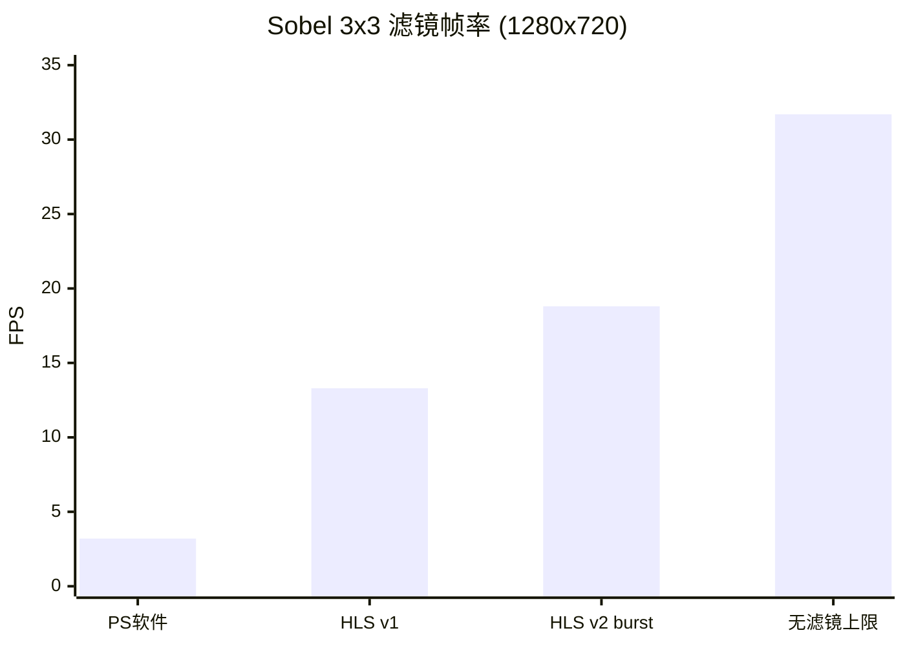

# FZ3A Zynq UltraScale+ FPGA — 实时视频流 + PL 加速 CNN/行人检测/图像滤镜

基于 ALINX FZ3A 开发板（Xilinx XCZU3EG ZynqMP），从零搭建的裸机（bare-metal）嵌入式视觉系统。实现了千兆以太网实时视频流、DisplayPort 显示输出，以及三个 FPGA PL 侧硬件加速器：CNN 手写数字识别、HOG+SVM 行人检测、实时图像滤镜。

## 系统架构



## 性能指标

### 视频流 + 滤镜

| 指标 | 值 |
|------|------|
| DP 输出分辨率 | 1280×720 @ 60Hz RGBA8888 |
| 网络吞吐 (TCP raw RGBA) | **108 MB/s** (91% 千兆效率) |
| 无滤镜帧率 | **31.7 fps** |
| Sobel 边缘检测 (HLS PL) | **18.8 fps** (PS 软件仅 3.2 fps, **5.9x 加速**) |
| 双缓冲无撕裂 | Trigger-per-frame mode |
| 支持滤镜 | 17 种 (Sobel/Laplacian/膨胀/腐蚀/Otsu/灰度/反色/热力图/低光增强等) |

### CNN 手写数字识别 (端口 5001)

| 指标 | 值 |
|------|------|
| 模型 | TinyLeNet: Conv1(5×5,8)→Pool→Conv2(5×5,16)→Pool→FC1(256→64)→FC2(64→10) |
| 精度 | **100%** (20/20 测试集), 训练集 98.83% |
| 推理延迟 | **3.7ms** (含 TCP 往返) |
| 计算位置 | **纯 PL FPGA** (Vitis HLS), PS 仅做数据搬运 |
| 量化 | INT8 权重, 嵌入 BRAM |
| PL 资源 | 12% LUT, 8% BRAM, 22% DSP |

### HOG+SVM 行人检测 (端口 5002)

| 指标 | 值 |
|------|------|
| 算法 | HOG 梯度 + 8×8 cell 直方图 + 滑窗线性 SVM (3780 维) |
| 输入 | 320×240 灰度图 |
| 检测窗口 | 64×128 (Dalal-Triggs), 步长 8px, 495 个窗口 |
| 帧处理时间 | **21.6ms** (~46 FPS) |
| 训练数据 | Penn-Fudan Pedestrian Dataset, 交叉验证准确率 86.4% |
| 计算位置 | **纯 PL FPGA**, 图像通过 m_axi DMA 从 DDR 读取 |

## 硬件平台

| 项 | 规格 |
|----|------|
| 开发板 | ALINX FZ3A |
| SoC | Xilinx Zynq UltraScale+ XCZU3EG-SFVC784 |
| PS | Quad-core ARM Cortex-A53 @ 1.2 GHz |
| PL | 70K LUT, 141K FF, 288 BRAM18, 360 DSP48 |
| DDR | 2GB DDR4 |
| 视频输出 | mini DisplayPort |
| 网络 | Gigabit Ethernet (KSZ9031 PHY) |
| 调试 | JTAG (Digilent SMT2), UART (CP2102) |

## 项目演进

| Commit | 阶段 | 内容 | 关键指标 |
|--------|------|------|----------|
| `2124afd` | Phase 2d | 视频流 + 17 图像滤镜 | 29.3 fps, 108 MB/s |
| `b080c46` | Phase 2e | PS 软件 MLP 推理 | 96% acc, 4.5ms |
| `b6d43a5` | Phase 2f | PL HLS 单层 matmul | 93% acc, ~20µs |
| `36851dc` | Phase 2g | **PL HLS TinyLeNet CNN** | 100% acc, 3.7ms |
| `cd954c4` | Phase 2i | **PL HLS 行人检测** | 46 FPS, 21.6ms |
| `f51133e` | Phase 2j | Penn-Fudan 真实训练 | 86.4% CV acc |
| `e7d67cd` | Phase 2l | **Burst 优化 HLS 滤镜** | 18.8 fps (5.9x) |

## 文件结构

```
├── README.md
│
├── firmware/                     # 裸机固件
│   ├── phase2b_main.c            #   主程序 (~1200 行): DP + TCP + 滤镜 + CNN/PED 接口
│   ├── stubs.c                   #   Newlib stubs
│   ├── lscript.ld                #   链接脚本
│   ├── lwipopts.h                #   lwIP 配置
│   └── build.ps1                 #   Windows 交叉编译脚本
│
├── hls/                          # Vitis HLS 加速器源码 (C++ → Verilog)
│   ├── cnn_hls_kernel.cpp        #   TinyLeNet CNN 推理
│   ├── cnn_hls_weights.h         #   CNN INT8 量化权重 (98.83% acc)
│   ├── ped_hls_kernel.cpp        #   HOG+SVM 行人检测
│   ├── ped_hls_weights.h         #   SVM INT8 权重 (Penn-Fudan, 86.4% CV)
│   ├── ped_svm_info.json         #   SVM 训练元数据
│   ├── filter_hls_kernel.cpp     #   视频滤镜 (burst-optimized)
│   ├── mnist_data.h              #   INT8 单层权重 (legacy HLS matmul)
│   └── cnn_scales.txt            #   量化 scale 参数
│
├── rtl/                          # Verilog RTL
│   ├── generated/                #   HLS 自动生成 (Vitis HLS → Vivado)
│   │   ├── cnn/                  #     CNN: 67 个 Verilog 模块
│   │   ├── ped/                  #     PED: 15 个 Verilog 模块
│   │   └── filter/               #     Filter: 31 个 Verilog 模块
│   └── handwritten/              #   手写 RTL (教学参考)
│       └── cnn/                  #     9 个模块: cnn_top, conv_layer, fc_layer 等
│
├── drivers/                      # lwIP 以太网驱动补丁
│   ├── xemacpsif.c
│   ├── xemacpsif_dma.c
│   ├── xemacpsif_hw.c
│   ├── xemacpsif_physpeed.c      #   KSZ9031 PHY read-only 模式
│   └── xadapter.c
│
├── scripts/                      # 部署/构建脚本
│   ├── boot_phase2b.tcl          #   XSDB 部署 (PSU init + ELF download)
│   ├── hotdow.tcl                #   热下载脚本
│   ├── add_lwip.tcl              #   BSP lwIP 配置
│   └── *.bat                     #   Windows 流媒体启动脚本
│
├── clients/                      # Python 测试客户端
│   ├── send_digit.py             #   CNN 数字识别 (端口 5001)
│   ├── send_ped.py               #   行人检测 (端口 5002)
│   ├── stream_video.py           #   视频文件流 (端口 5000, Linux)
│   ├── stream_video_win.py       #   视频文件流 (Windows)
│   ├── stream_desktop.py         #   桌面屏幕流
│   ├── stream_rtsp.py            #   RTSP 中转流
│   ├── cam_to_fz3a.py            #   摄像头流
│   └── stream_test*.py           #   合成测试图案
│
├── training/                     # 模型训练
│   ├── mnist_train_export.py     #   MNIST MLP 训练 + C 导出
│   ├── mnist_weights.h           #   float32 MLP 权重 (PS fallback)
│   └── mnist_weights.npz         #   NumPy 权重缓存
│
├── test_data/                    # 测试数据
│   ├── digit_pngs/               #   20 张 MNIST 测试图
│   └── test_video.mp4            #   测试视频
│
├── docs/                         # 历史阶段参考源码
│   ├── dp_main.c                 #   Phase 1: DP 显示
│   ├── eth_main.c                #   Phase 2a: 以太网
│   └── ref_*.c                   #   Xilinx 参考实现
│
└── windows_artifacts/            # 预编译二进制
    └── phase2b.elf               #   最终固件 (~1.15 MB)
```

## 实现细节

### 1. 视频流管线

```
PC (ffmpeg/Python) ──TCP 5000──▶ lwIP TCP 接收 ──▶ 帧缓冲 (DDR 0x10000000)
                                                         │
                                              ┌──────────▼──────────┐
                                              │  Filter HLS (可选)   │
                                              │  m_axi burst 读写   │
                                              └──────────┬──────────┘
                                                         │
                                              DPDMA 自动读取 ──▶ DisplayPort
```

**关键技术突破:**
- **D-cache 与 DPDMA 共存**: 用 `NORM_NONCACHE` TLB 属性标记帧缓冲区域 (0x10000000-0x10800000)，而非 Xilinx 官方的 `Xil_DCacheDisable()` 方案。保持 lwIP/TCP 在缓存区域全速运行。
- **双缓冲无撕裂**: `XDpDma_DisplayGfxFrameBuffer` + `SetupChannel` + `Trigger` 序列实现原子帧切换。
- **KSZ9031 PHY read-only**: 裸机固件不操作 PHY MDIO，保留 Linux 已配置的千兆链路状态。

### 2. CNN TinyLeNet (Vitis HLS)

#### CNN 网络结构详图

```mermaid
graph TD
    INPUT["输入图像<br/>28 x 28 x 1<br/>uint8 (784 bytes)"]

    subgraph CONV1_BLOCK ["Conv1 Block"]
        CONV1["Conv2D<br/>kernel: 5x5, stride: 1<br/>in: 1ch, out: 8ch<br/>weights: 200 int8<br/>bias: 8 int32"]
        RELU1["ReLU<br/>max(0, x)"]
        POOL1["MaxPool 2x2<br/>stride: 2"]
    end

    subgraph CONV2_BLOCK ["Conv2 Block"]
        CONV2["Conv2D<br/>kernel: 5x5, stride: 1<br/>in: 8ch, out: 16ch<br/>weights: 3200 int8<br/>bias: 16 int32"]
        RELU2["ReLU<br/>max(0, x)"]
        POOL2["MaxPool 2x2<br/>stride: 2"]
    end

    FLAT["Flatten<br/>16 x 4 x 4 = 256"]

    subgraph FC_BLOCK ["Fully Connected"]
        FC1["FC1: 256 → 64<br/>weights: 16384 int8<br/>bias: 64 int32"]
        RELU3["ReLU"]
        FC2["FC2: 64 → 10<br/>weights: 640 int8<br/>bias: 10 int32"]
    end

    ARGMAX["Argmax<br/>→ 预测类别 0-9"]
    OUTPUT["输出<br/>pred: uint8<br/>scores: 10 x int32"]

    INPUT -->|"28x28x1"| CONV1
    CONV1 -->|"24x24x8"| RELU1
    RELU1 -->|"24x24x8"| POOL1
    POOL1 -->|"12x12x8"| CONV2
    CONV2 -->|"8x8x16"| RELU2
    RELU2 -->|"8x8x16"| POOL2
    POOL2 -->|"4x4x16"| FLAT
    FLAT -->|"256"| FC1
    FC1 -->|"64"| RELU3
    RELU3 -->|"64"| FC2
    FC2 -->|"10"| ARGMAX
    ARGMAX --> OUTPUT

    style INPUT fill:#c8e6c9,stroke:#2e7d32
    style OUTPUT fill:#ffcdd2,stroke:#c62828
    style CONV1_BLOCK fill:#e3f2fd,stroke:#1565c0
    style CONV2_BLOCK fill:#e3f2fd,stroke:#1565c0
    style FC_BLOCK fill:#fce4ec,stroke:#ad1457
```



#### CNN 数据流维度变化



#### CNN 量化与 HLS 实现流程



#### CNN HLS 资源使用



**HLS 实现:**
- 所有层在单个 HLS kernel 中顺序执行
- 权重在编译时嵌入 (INT8 量化, PyTorch 训练)
- AXI-Lite 接口: PS 写入 784 字节图像 (4 字节打包), 读回预测 + 10 个分数
- 资源: 35 BRAM18, 81 DSP48

**训练流程:**
```bash
# 在 GPU 服务器上
python3 train_mnist.py          # PyTorch TinyLeNet, 98.83% test acc
python3 quantize.py             # FP32 → INT8, 生成 C 头文件
```

### 3. HOG+SVM 行人检测 (Vitis HLS)

#### 行人检测处理流水线



#### 行人检测 AXI 数据通路



**HLS 实现:**
- `m_axi` 接口从 DDR 读取图像 (76800 字节 burst), `s_axilite` 用于控制和结果
- PS 把图像放 DDR → 传地址给 HLS → HLS 自己做 DMA 读取
- SmartConnect 桥接 m_axi 到 PS S_AXI_HP0_FPD 高性能端口

**训练流程:**
```bash
# Penn-Fudan Pedestrian Dataset
python3 train_inria_svm.py      # scikit-learn LinearSVC, 86.4% CV acc
```

### 4. HLS 图像滤镜 (Burst-Optimized)

#### 滤镜 HLS 处理流水线



#### 滤镜性能对比



**Burst 优化:**
- `max_read_burst_length=64`, `max_write_burst_length=64`
- `memcpy` 整行 (1280 pixels) 触发 HLS burst 推断
- `PIPELINE II=1` 所有内循环
- `ARRAY_PARTITION` line buffer 支持并行 3×3 访问
- 零拷贝双缓冲: HLS 读 back buffer → 写 front buffer

**性能对比:**

| 滤镜方式 | Sobel FPS | 加速比 |
|----------|-----------|--------|
| PS 软件 (ARM A53) | 3.2 fps | 1x |
| HLS v1 (无 burst) | 13.3 fps | 4.2x |
| **HLS v2 (burst)** | **18.8 fps** | **5.9x** |

### 5. Vivado Block Design

```
┌─────────────────────────────────────────────────────────────┐
│  Zynq UltraScale+ PS                                       │
│  ├── M_AXI_HPM0_FPD ──▶ AXI Interconnect                  │
│  │                       ├── M00 → axi_gpio (0xA0000000)   │
│  │                       ├── M01 → ped_hls  (0xA0010000)   │
│  │                       ├── M02 → cnn_hls  (0xA0020000)   │
│  │                       └── M03 → filter_hls (0xA0030000) │
│  │                                                          │
│  └── S_AXI_HP0_FPD ◀── SmartConnect                       │
│                          ├── S00 ← ped_hls/m_axi_gmem      │
│                          ├── S01 ← filter_hls/m_axi_gmem0  │
│                          └── S02 ← filter_hls/m_axi_gmem1  │
└─────────────────────────────────────────────────────────────┘
```

## 构建指南

### 环境要求

| 工具 | 版本 |
|------|------|
| Vivado | 2024.2 |
| Vitis HLS | 2024.2 |
| 交叉编译器 | aarch64-none-elf-gcc (Vitis 内置) |
| Python | 3.x + numpy, pillow |
| PyTorch | 2.x (训练用, 可选) |

### 1. HLS IP 综合

```bash
# CNN
cd cnn/hls
vitis_hls -f run_cnn_hls.tcl

# 行人检测
cd ped/hls
vitis_hls -f run_ped_hls.tcl

# 滤镜
cd filter/hls
vitis_hls -f run_filter_hls.tcl
```

### 2. Vivado Bitstream

```bash
vivado -mode batch -source integrate_all.tcl
# 输出: design_1_wrapper.bit
```

### 3. 固件编译 (Windows)

```powershell
cd dp
.\build.ps1
# 输出: phase2b.elf
```

### 4. 部署

```bash
# XSDB 部署
xsdb boot_phase2b.tcl           # PSU init + ELF download
xsdb flash_and_reset.tcl        # Hot-swap PL bitstream
xsdb boot_after_flash.tcl       # Reload firmware after PL flash
```

### 5. 测试

```bash
# 视频流
python3 stream_video.py test_video.mp4 <board_ip>

# CNN 数字识别
python3 send_digit.py digit_pngs/digit_7_0.png <board_ip>

# 行人检测
python3 send_ped.py test <board_ip>
```

## 网络协议

### 端口 5000: 视频流

```
client → board:  "IMG\0" + width(4) + height(4) + format(4) + W×H×4 bytes RGBA
board  → 无回复 (直接显示到 DP)
```

### 端口 5001: CNN 推理

```
client → board:  "MNI\0" + w(4)=28 + h(4)=28 + fmt(4) + 784 bytes u8 grayscale
board  → client: "CLS\0" + pred(1) + pad(3) + 10 × float32 probabilities
```

### 端口 5002: 行人检测

```
client → board:  "PED\0" + w(4)=320 + h(4)=240 + fmt(4) + 76800 bytes u8 grayscale
board  → client: "DET\0" + n_dets(4) + n × {pos_word(4) + score_word(4)}
                  pos_word = (y << 8) | x
```

## FPGA 资源使用

| IP | LUT | FF | BRAM18 | DSP48 |
|----|-----|----|--------|-------|
| CNN TinyLeNet | ~9000 | ~7400 | 35 | 81 |
| PED HOG+SVM | ~5000 | ~5000 | ~90 | 4 |
| Filter (burst) | ~3000 | ~3000 | ~5 | 4 |
| AXI 基础设施 | ~3000 | ~4000 | ~5 | 0 |
| **总计** | **~20000** | **~19400** | **~135** | **89** |
| **ZU3EG 容量** | 70,560 | 141,120 | 288 | 360 |
| **利用率** | **28%** | **14%** | **47%** | **25%** |

## 已知限制与后续改进

1. **PED SVM 权重**: 使用 Penn-Fudan 数据集训练 (86.4% CV), 用 INRIA Person Dataset 可提升到 >95%
2. **PED 无 NMS**: 重叠检测框原样返回, PS 侧可做简单贪心 NMS
3. **PED 单尺度**: 仅 64×128 窗口, 多尺度需 PS 缩放图像重复推理
4. **滤镜 18.8 fps**: 受 DDR 带宽限制 (3.7MB/帧 × 读写), 可通过 AXI-Stream 直接接入 TCP 接收路径优化
5. **热替换 PL 断网**: 重编程 FPGA 会重置以太网 PHY; 解决方案: 将 bitstream 烧入 QSPI flash

## 许可

本项目仅供学习和研究使用。
